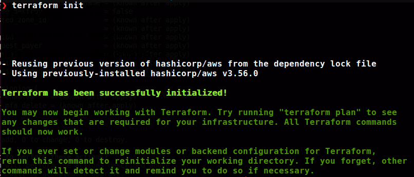
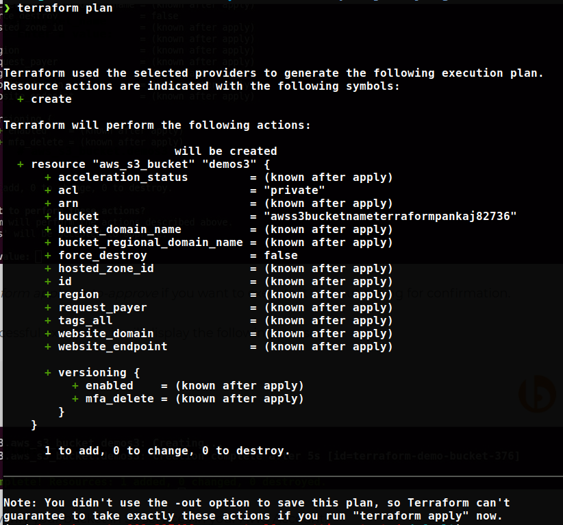
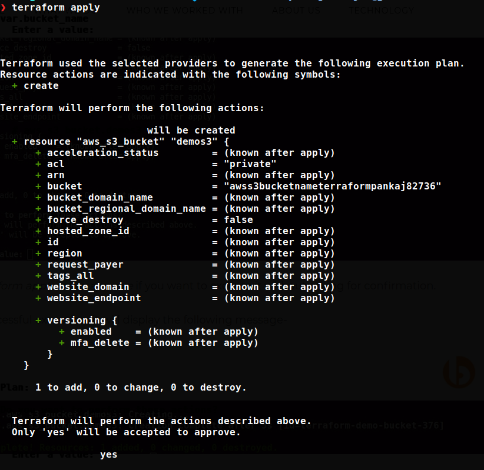

# Intro

This is a sample and basic version of how you create AWS S3 bucket using Terraform. Its not completetly automated but yes almost.


## Current Limitations of this script
You will need to hardcode the Bucket name by replacing the placeholder `REPLACE_ME_BUCKET_NAME` in file bucket.tf

---------------------------------------------

You also need to replace three below mentioned placeholders with their actual value in file variable.tf

- REPLACE_ME_SECRET_KEY
- REPLACE_ME_ACCESS_KEY
- REPLACE_ME_REGION


## Deploying your code to infra

```
terraform init
```  




```
terraform plan
```  




```
terraform apply
```




Enter confirmation asked when you run terraform apply

To destroy the deployed code, run 

```
terraform destroy -auto-approve
```